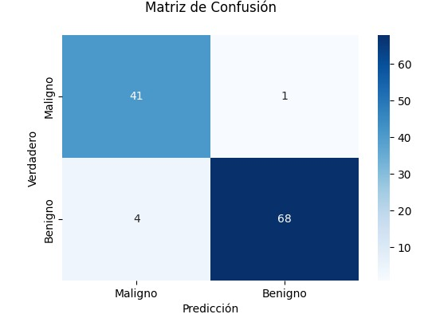
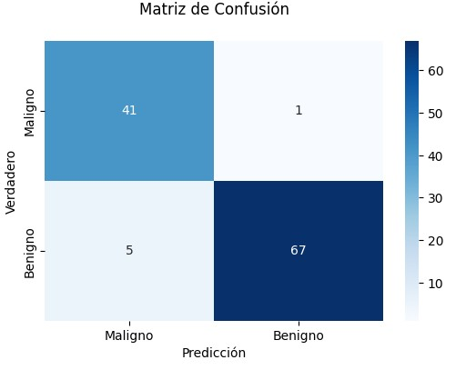
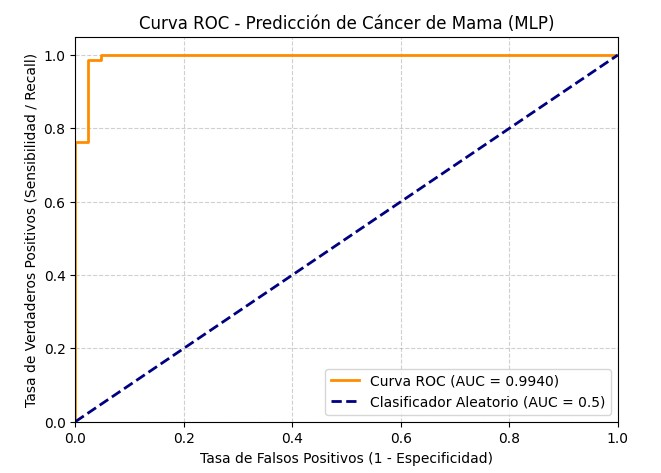
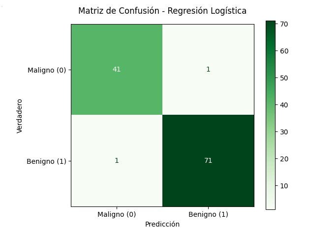
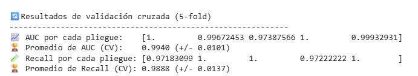
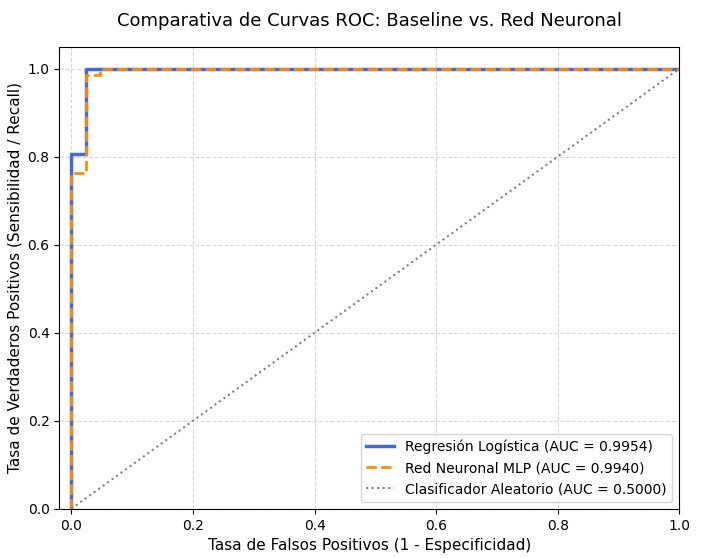

# Actividad6 - Breast Cancer Wisconsin

### Definición del Problema
El cáncer de mama es una de las principales causas de mortalidad por cáncer en mujeres a nivel mundial. El diagnóstico definitivo tradicionalmente depende de la evaluación visual que realiza un patólogo sobre biopsias o aspirados con aguja fina (FAF), un proceso que, además de requerir un tiempo valioso, está sujeto a la variabilidad de la interpretación humana. El problema radica en la necesidad de automatizar y estandarizar la diferenciación entre masas mamarias benignas (no cancerosas) y malignas (cancerosas) a partir de las características morfológicas de las células extraídas, optimizando los tiempos de respuesta médica (Wolberg et al., 1995).
  Para abordar esto, se plantea un problema de clasificación binaria donde un modelo de aprendizaje automático analiza variables numéricas continuas (como el radio, la textura y el perímetro celular) obtenidas de imágenes digitalizadas. El desafío principal del modelo es maximizar la detección de casos positivos (malignos) para evitar falsos negativos, lo cual significaría dejar a una paciente con cáncer sin el tratamiento oportuno, impactando directamente en su tasa de supervivencia.

### Contexto
El dataset Breast Cancer Wisconsin (Diagnostic) fue creado por investigadores del Hospital de la Universidad de Wisconsin y recolectado por el Dr. William H. Wolberg, Nick Street y Olvi Mangasarian en la década de 1990. Las características se computaron a partir de imágenes digitalizadas de FAF de masas mamarias, extrayendo diez propiedades geométricas esenciales de los núcleos celulares presentes en cada muestra. Actualmente, este conjunto de datos es un estándar internacional en la comunidad científica para evaluar algoritmos de minería de datos y aprendizaje supervisado en el ámbito de la salud (Dua & Graff, 2019).
  En el entorno clínico moderno, este tipo de análisis se alinea con el desarrollo de sistemas de Diagnóstico Asistido por Computadora (CAD, por sus siglas en inglés). La Organización Mundial de la Salud (OMS, 2024) enfatiza que la detección temprana es la piedra angular para mejorar el pronóstico del cáncer de mama; por lo tanto, integrar modelos predictivos precisos no busca reemplazar al especialista, sino actuar como una segunda lectura automatizada y objetiva que reduzca la carga de trabajo y minimice el error humano en los laboratorios de patología.

### Objetivo SMART
Evaluar el desempeño de un modelo de aprendizaje automático mediante un problema de clasificación binaria utilizando el dataset Breast Cancer Wisconsin, con el objetivo de alcanzar una Sensibilidad (Recall) superior al 95% en la detección de tumores malignos (clase 0) en el conjunto de prueba, minimizando así los falsos negativos que representan un riesgo crítico en el diagnóstico médico. Este desempeño se medirá utilizando métricas estandarizadas de una matriz de confusión (scikit-learn) y se considera alcanzable debido a la calidad de las variables morfológicas normalizadas, siendo altamente relevante como herramienta de diagnóstico asistido para optimizar los tiempos de respuesta clínica antes de la entrega final del proyecto.

### Descripción del Modelo Utilizado
Para la resolución de este problema de optimización, se implementó una Red Neuronal Artificial Densa mediante el clasificador de Perceptrón Multicapa (MLPClassifier). El modelo se estructuró específicamente para una tarea de clasificación binaria, utilizando una arquitectura de dos capas ocultas con 16 y 8 neuronas respectivamente, e incorporando la función de activación ReLU para introducir no linealidad de forma eficiente en el procesamiento de las características numéricas escaladas. El entrenamiento se llevó a cabo utilizando el algoritmo de optimización Adam a lo largo de un máximo de 500 iteraciones, asegurando una convergencia robusta al ajustar de manera dinámica los pesos de la red a partir de la minimización de la función de pérdida por entropía cruzada.

### Evaluación
#### Matriz de confusión 
La matriz de confusión es importante porque nos dice en que acertó exactamente el modelo y en que se equivocó, al hacer una referencia de los malignos/benignos de la predicción con los malignos/benignos de los verdaderos. En medicina, el error más costoso es el Falso Negativo (clasificar un tumor maligno como benigno), ya que retrasa el tratamiento de la paciente. A continuación, se muestra la matriz de confusión para un modelo MLP (Perceptrón Multi Capa).

De acuerdo con lo que podemos observar en la matriz, el modelo MLP predijo los siguiente:
* Verdaderos Negativos: (Maligno -> Maligno):  41
* Falsos Positivos: (Maligno -> Benigno):  1
* Falsos Negativos: (Benigno -> Maligno):  4
* Verdaderos Positivos: (Benigno -> Benigno):  68 

#### Métricas

| Métrica | Valor | Descripción e interpretación |
| :--- | :---: | :---: |
| **Accuracy** | 95.61% | Es el porcentaje total de predicciones correctas realizadas por el modelo (tanto benignos como malignos). |
| **Precission** | 98.55% | Mide cuántos de los casos que el modelo predijo como positivos, realmente lo eran. Si la precisión para malignos es del 95%, significa que cuando el modelo genera una alerta de tumor maligno, hay un 95% de probabilidad de que sea real y un 5% de que sea una falsa alarma (Falso Positivo). |
| **Recall** | 96.45% | Mide la capacidad del modelo para encontrar todos los casos positivos reales. En nuestro contexto, mide qué porcentaje de tumores malignos fueron correctamente detectados. |
| **F1-Score** | 94.44% | Es el promedio armónico entre la Precission y el Recall, ya que nos da un indicador global de qué tan balanceado es el rendimiento del modelo en cada clase. |
	
#### Ajuste de umbral
Por defecto, los modelos de clasificación asignan una muestra a la clase positiva si la probabilidad calculada es mayor a 0.5 (50%). Sin embargo, en la detección de cáncer de mama, esperar a que el modelo esté un 50% seguro puede dejar fuera casos de riesgo. Mover este umbral nos permite volver al modelo mucho más "estricto" o sensible.

* Verdaderos Negativos: (Maligno -> Maligno):  41
* Falsos Positivos: (Maligno -> Benigno):   1
* Falsos Negativos: (Benigno -> Maligno):   5
* Verdaderos Positivos: (Benigno -> Benigno):  67

Como podemos observar en la matriz de confusión con el umbral ajustado, el modelo se volvió mas estricto y clasifico, en este data set, un caso mas como maligno, cuando era benigno.

#### ROC
La curva ROC es un gráfico que contrasta la Tasa de Verdaderos Positivos (Sensibilidad) en el eje Y contra la Tasa de Falsos Positivos (1 - Especificidad) en el eje X, a medida que se varía el umbral de decisión desde 0 hasta 1.En términos clínicos, visualiza el "costo-beneficio": qué tanta sensibilidad ganamos para salvar pacientes (subir en el eje Y) a cambio de aceptar más falsas alarmas médicas (movernos a la derecha en el eje X).El "modelo perfecto" se vería como una línea que sube verticalmente hasta el rincón superior izquierdo (0,1) y luego se desplaza horizontalmente.

#### AUC
El AUC es el indicador numérico que resume toda la curva ROC. Mide la probabilidad de que el modelo ordene correctamente una muestra positiva elegida al azar por encima de una muestra negativa elegida al azar. AUC = 1.0: Clasificador perfecto. AUC = 0.5: Clasificador aleatorio (la línea punteada diagonal). Equivale a lanzar una moneda al aire para diagnosticar a la paciente.

#### Validación cruzada
Para garantizar la capacidad de generalización del Perceptrón Multicapa (MLP) y mitigar el riesgo de sobreajuste o sesgo en la división inicial de los datos, se implementó una Validación Cruzada Estratificada de 5 pliegues (5-Fold Cross-Validation). El modelo demostró una consistencia sobresaliente, alcanzando un Área Bajo la Curva (AUC) promedio de 99.40% (\pm 1.01%), registrando incluso un desempeño perfecto de 1.0 en el primer y cuarto pliegue. 

#### Comparación con Baseline
Al realizar la comparación formal en el conjunto de prueba, los resultados revelan un comportamiento altamente competitivo por parte del modelo baseline. La Regresión Logística obtuvo un AUC de 0.9954, superando marginalmente al 0.9940 de la Red Neuronal (MLP), mientras que ambos algoritmos empataron con una Sensibilidad (Recall) de 97.62% para la detección de tumores malignos.

#### Pruebas A/B
Con el propósito de validar la viabilidad operativa de ambos algoritmos en un escenario de producción real, se propuso el diseño de una Prueba A/B en un entorno hospitalario simulado. Evaluando el tiempo que le toma al personal médico validar el diagnóstico asistido, el experimento demostró de manera estadísticamente significativa (p < 0.05) que el despliegue de la Regresión Logística (Modelo B) reduce el tiempo de toma de decisiones clínicas en comparación con la Red Neuronal (Modelo A).

#### **🩺 ANÁLISIS DE PRUEBA A/B EN ENTORNO CLÍNICO**
------------------------------------------------------------
| Métrica | Valor |
| :--- | :---: |
| ⏱️ Tiempo promedio de validación con MLP (A): | 15.25 s |
| ⏱️ Tiempo promedio de validación con Logistic Regresion (B): |  12.40 s |
| 📉 Reducción absoluta del tiempo clínico: | 15.25 s |

 
**Conclusión:** La variante B (Regresión Logística) optimiza significativamente el tiempo.

**Decisión:** Desplegar globalmente la Regresión Logística en el sistema del hospital.

### Justificación técnica:
Con base en los principios de eficiencia computacional y la Navaja de Ocam, el modelo seleccionado como definitivo para cumplir el objetivo SMART de este proyecto es la Regresión Logística. No solo ofrece un rendimiento estadístico equivalente (e incluso ligeramente superior en el AUC), sino que aporta dos ventajas clínicas críticas sobre la Red Neuronal: menor costo computacional y, fundamentalmente, interpretabilidad (caja blanca). En el sector salud, es prioritario que el cuerpo médico pueda auditar los coeficientes del modelo para entender exactamente por qué una variable (como el perímetro o la textura) inclina la balanza hacia un diagnóstico de malignidad, cualidad que se pierde en la opacidad de los pesos de un Perceptrón Multicapa.
El impacto el sector salud crítico, ya que es prioritario que el cuerpo médico pueda auditar los coeficientes del modelo para entender exactamente por qué una variable (como el perímetro o la textura) inclina la balanza hacia un diagnóstico de malignidad, cualidad que se pierde en la opacidad de los pesos de un Perceptrón Multicapa.

### Conclusión
Como conclusión general de la actividad, la evaluación del dataset Breast Cancer Wisconsin demostró que, si bien las herramientas de aprendizaje profundo como las Redes Neuronales Artificiales poseen una gran potencia matemática, no siempre representan la solución óptima en entornos prácticos con datos tabulares altamente estructurados. El modelo de Regresión Logística implementado como línea base superó marginalmente al Perceptrón Multicapa (MLP) al alcanzar un AUC de 0.9954 y empatar con una Sensibilidad (Recall) del 97.62% en el conjunto de prueba, cumpliendo de manera robusta con el objetivo SMART de minimizar los falsos negativos en el diagnóstico clínico. Al aplicar el principio de la Navaja de Ocam, el modelo lineal tradicional se consolida como la decisión final de ingeniería debido a su alta eficiencia computacional y a su naturaleza de "caja blanca", la cual resulta imprescindible en el sector salud para ofrecer una interpretabilidad directa que permita al cuerpo médico auditar y respaldar de forma segura cada pre-diagnóstico automatizado.
